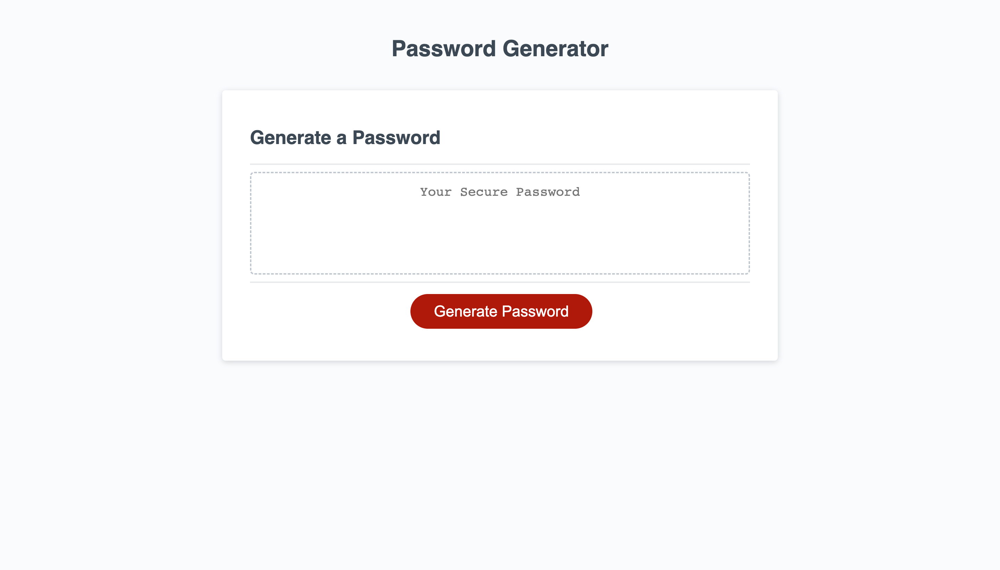

# Password Generator

## Description

In our present-day society, digital media and the internet have become integral parts of our lives. We heavily rely on them for various activities such as online shopping, banking, app subscriptions, cryptocurrency transactions, and much more. To ensure the security of these transactions, users heavily depend on passwords, but traditional password choices are no longer sufficient.

To address this need, this innovative app has been developed, that generates unconventional passwords tailored to individual preferences. This project aims to provide a reliable solution for those seeking strong passwords, customized according to their desired length and character types.

Embrace the power of advanced password generation and take control of your online security today with our cutting-edge app.

## Usage

By utilizing this app, users can enhance the security of their online presence and safeguard their valuable digital assets. With the convenience of generating unique and unconventional passwords, individuals can confidently engage in various online activities, knowing that their personal information and transactions are well protected.

## Badges

## Features

- This app is mobile responsive.
- This app can generate passwords of length starting from 8 upto 128 characters.

## Useful Links

- [Github Repo](https://github.com/sucheta90/password_generator)
- [Live Site](https://sucheta90.github.io/password_generator)
